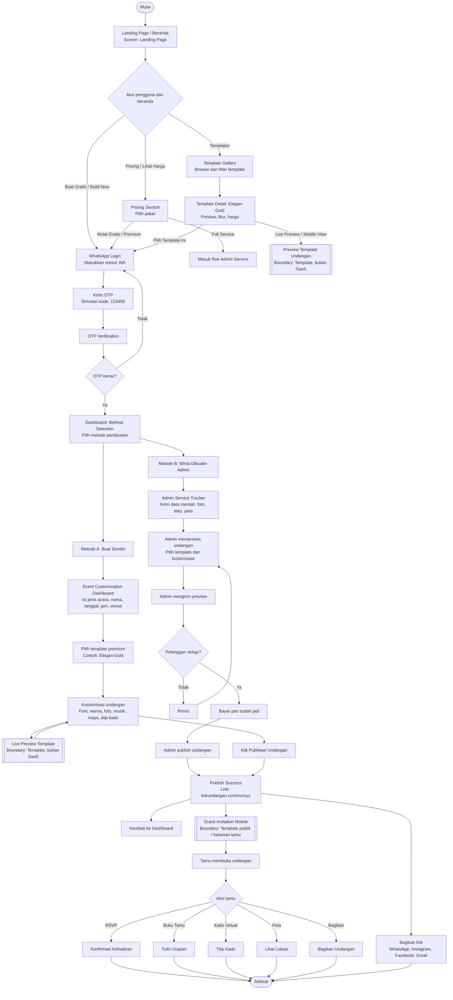
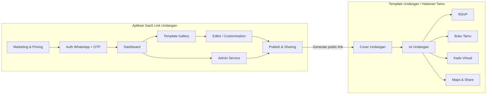

# Diagram Alir Aplikasi SaaS Link Undangan

Sumber mockup: Stitch project `2094056565527635761`.

Catatan pemisahan:
- **Aplikasi SaaS**: beranda, harga, galeri template, login WhatsApp, OTP, dashboard, editor, admin service, publish.
- **Template undangan/tamu**: output terpisah yang hanya dipakai sebagai preview atau link publik setelah undangan dipublikasikan.

## Screen SaaS Dari Stitch

- `Landing Page - IndoInvite`
- `WhatsApp Login - IndoInvite`
- `OTP Verification - IndoInvite`
- `Method Selection - IndoInvite Dashboard`
- `Template Gallery - IndoInvite`
- `Template Detail: Elegan-Gold - IndoInvite`
- `Event Customization - IndoInvite Dashboard`
- `Admin Service Tracker - IndoInvite`
- `Publish Success - IndoInvite`

## Screen Template / Output Terpisah

- `Guest Invitation - Link Undangan (Mobile)`
- `Guest Invitation - IndoInvite (Mobile)`

## Ringkasan Pemisahan Produk

